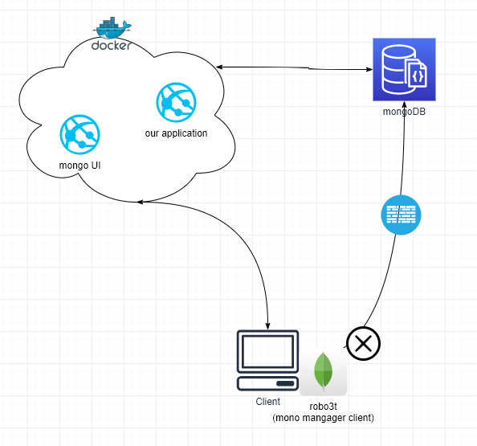
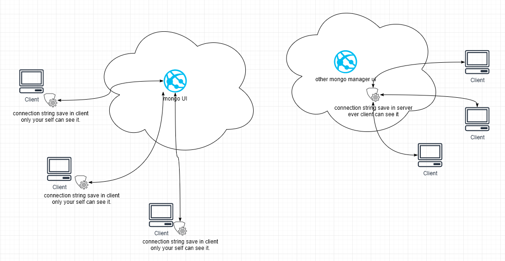

@[TOC](Welcome)

# 欢迎使用Mongo UI
本项目的开发是为了解决以下两个问题：

1.  因防火墙，mongo client端管理工具无法直连mongoDB 服务器

2. 某些Web版mongo管理工具，连接mongoDB字符串保存在服务器上，令所有连该服务器的用户都可以看到。

## 语言
NodeJS

## 框架
- vue
- quasar

## 启动
首先安装依赖库
```yarn install```

- 开发环境
```yarn dev```

- 部署
```
yarn build
yarn start
```

## Docker镜像制作
项目根目录下
```
docker build -f Dockerfile .
```

